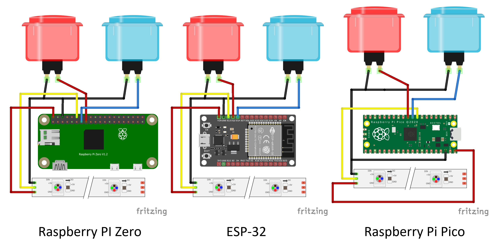

# Two Button Game

This started as a Raspberry Pi jam challenge to make a game that you control with two buttons.

It ended up as a single source code file that will run on Raspberry PI, ESP32, Raspberry PI Pico,  PICO-RGB from Pimoroni and as an MQTT hosted game for use by Connected Little Boxes. 
## Installation
To install the game just copy the single game file onto the target device and then uncomment the statement setting the version that you want to use:
```
# Uncomment the version that you want to run.
version="RPI"
#version="ESP32"
#version="PICO"
#version="PICO-RGB"
#version="CLB"
```
## Hardware settings

These are the connections for the different hardware devices. If you are using the PICO-RGB the connections are already set for that device. You can use different connections but you will have to modify the program to match.
## Connected Little Boxes
Ff you're using the CLB version you will need two boxes that each contain a button and a pixel ring. You have to set your MQTT server credentials and the names of the devices that are running the Connected Little Boxes software. You can find full details of this version of the game on the Connected Little Boxes site here: https://www.connectedlittleboxes.com/projects.html

## Gameplay
The game itself is very simple:

1. When the game starts the lights will flash white. When the white flashing finishes, you need to start pressing buttons.
2. The game box has coloured lights all round it. If you see more red lights that blue ones, press the red button. If you see more blue lights than red ones, press the blue button. If you get it right you get a flash of green lights and then you get to go again.
3. If you get it wrong you get a red flash (boo) and then the game shows you your score by flashing all the leds. The number of yellow flashes gives you the tens, the number of magenta flashes gives you the units. Then the game starts again. 
4. If you don't press a button in time the game ends. If you leave the game alone all the lights turn off, but they flash cyan every now and then to remind you that you've left it switched on.

And that's it. Take a look at the code if you want to know how it works. If you have any better ideas for a game involving a box with lights and two buttons on it, let me know. 